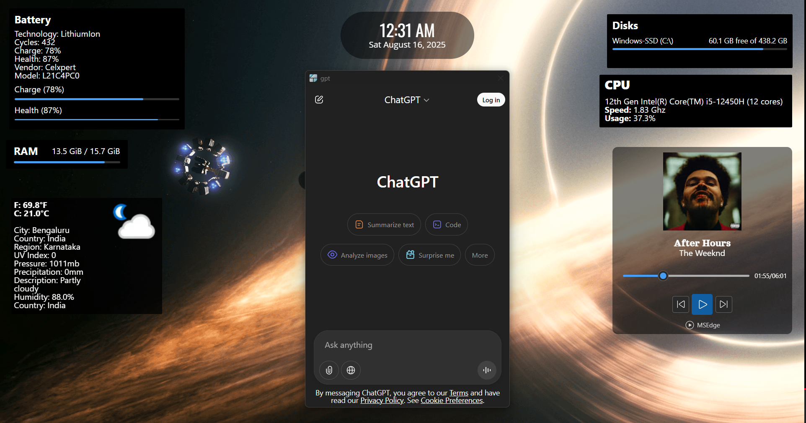
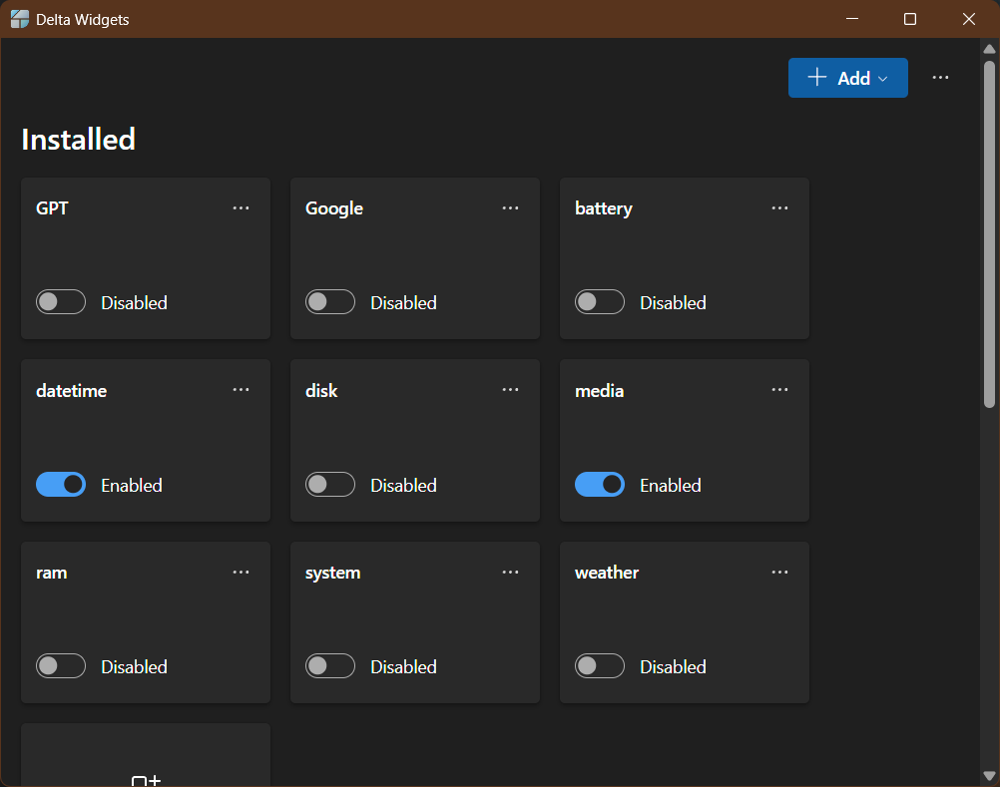
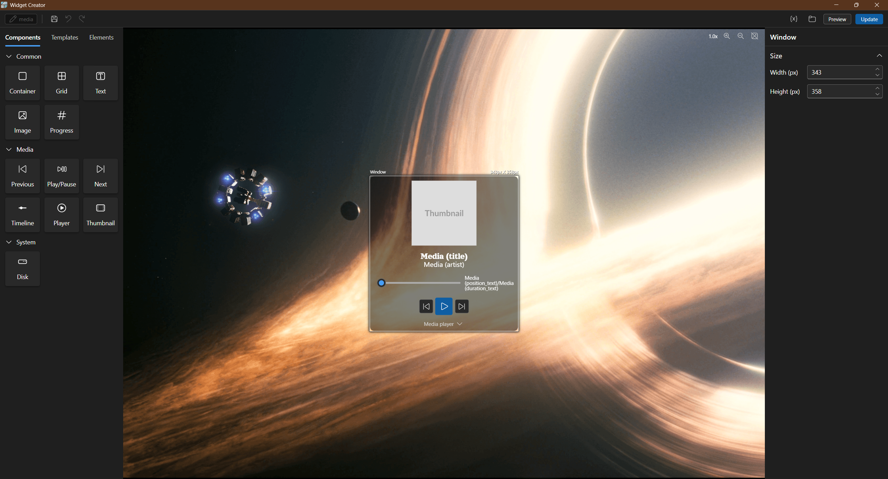
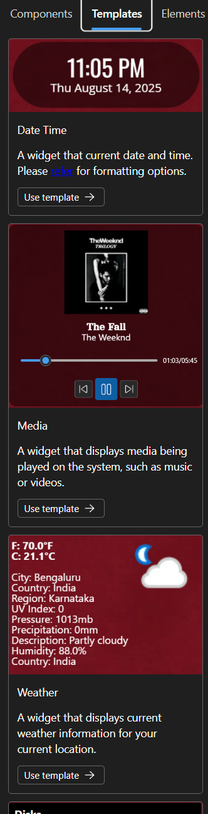

# Delta Widgets

Widget maker for Windows (for now).

# Features

- Drag and Drop Builder – No coding needed.
- Multiple sources – Create widgets using the builder, or display a **custom HTML page**, or use a **URL**.
- Easy layout – Uses HTML & CSS to create the widget's layout.
- Custom Templates – Start from pre-made widgets or build your own.
- Dynamic Data – Add time, system info, playing media info, or custom CSS.
- Expressions – Format text, embed variables.
- Built with Tauri – Fast, secure, native feel.

\* This app collects anonymous usage statistics (install and widget enable events) via Mixpanel. No personal data is tracked. Data is only used to measure installs and improve the app.

# Screenshots

Desktop

Main window

Creator window

Templates

# Documentation

Visit the full documentation [here](https://amaan-mohib.github.io/delta-widgets)

# Build

## Tauri + React + Typescript

This project was developed with Tauri, React and Typescript in Vite.

### Recommended IDE Setup

- [VS Code](https://code.visualstudio.com/) + [Tauri](https://marketplace.visualstudio.com/items?itemName=tauri-apps.tauri-vscode) + [rust-analyzer](https://marketplace.visualstudio.com/items?itemName=rust-lang.rust-analyzer)

# Support

