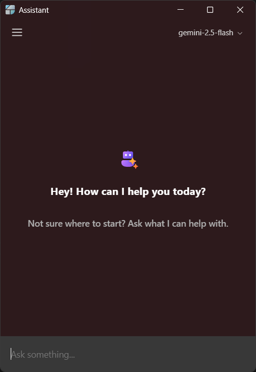

# AI Assistant

Delta Widgets ships with an **optional** AI assistant that can generate and edit widgets for you from a chat prompt, and answer questions about your media history.

!!! info "Completely optional (BYOK)"

    The assistant is **bring-your-own-key (BYOK)**. Core widget functionality works without it. Nothing AI-related runs — and no key is required — until you add a model yourself. There is no Delta Widgets backend involved: requests go **directly** from the app to the provider you configure.

---

## Opening the assistant

Open the **main window** and click the **assistant** entry in the sidebar. This launches a separate assistant window where you can chat, manage chats, and configure models.

---

## Adding a model

The first time you open the assistant you'll be asked to set up a model. You can add more later from the assistant's **Settings**.

Each model has the following fields:

| Field              | Required               | Notes                                                                                                        |
| ------------------ | ---------------------- | ------------------------------------------------------------------------------------------------------------ |
| **Provider**       | Yes                    | One of the supported providers below.                                                                        |
| **Name**           | No                     | A friendly display name (e.g. `Work GPT-5`). Defaults to the model id.                                       |
| **Model**          | Yes                    | The provider's model id (e.g. `gpt-4`, `claude-3`, `gemini-2.5-flash`, `phi4-mini:3.8b`, `openrouter/free`). |
| **API Key**        | Yes (except Ollama)    | Stored encrypted in your OS keyring — see [Where keys are stored](#where-keys-are-stored).                   |
| **Base URL**       | No (hidden for Gemini) | Override the provider endpoint. Defaults are shown per-provider below.                                       |
| **Custom headers** | No                     | Extra request headers as a JSON object.                                                                      |

When you click **Add**/**Update**, the app runs a quick **test connection** (a `Ping → pong` request with retries disabled). The model is only saved if that request succeeds, so an invalid key or model id surfaces immediately.

### Supported providers

| Provider          | Default base URL               | API key            |
| ----------------- | ------------------------------ | ------------------ |
| **OpenAI**        | `https://api.openai.com/v1`    | Required           |
| **Anthropic**     | `https://api.anthropic.com/v1` | Required           |
| **Google Gemini** | _(SDK default)_                | Required           |
| **Ollama**        | `http://localhost:11434`       | Not needed (local) |
| **OpenRouter**    | `https://openrouter.ai/api/v1` | Required           |

!!! tip "Try it for free"

    You can start with a free [OpenRouter](https://openrouter.ai/openrouter/free) model — no paid key required.

Reasoning/thinking is minimized by default on providers that support it (OpenAI `reasoningEffort: low`, Anthropic thinking disabled, Gemini `thinkingBudget: 0`, OpenRouter `effort: low`) to keep responses fast and cheap.

---

## What the assistant can do

The assistant is wired with tools that let it build widgets and read your local media history:

- **`read_widget_schema`** — loads the widget schema, validation rules, available dynamic variables, and example templates (or, for HTML widgets, the available Tauri commands and events) before generating.
- **`write_json_widget` / `update_json_widget`** — creates or updates a Visual-Editor (`json`) widget. The result is validated against the schema and opened in the Creator.
- **`write_html_widget` / `update_html_widget`** — creates or updates a self-contained HTML widget (all CSS in `<style>`, all JS in `<script>`, no external files).
- **`query_media_history`** — answers questions about your media playback history (`history`, `top_media`, `top_artists`, `stats`).

Generated widgets start as **Drafts** (JSON) or are opened directly, and can then be published like any other widget. See the [Overview](overview.md) for how the three widget types differ.

---

## Data & privacy

- **Chats and messages** are stored locally in a SQLite database on your machine (see [Settings & Data](settings.md#where-your-data-lives)). The assistant also auto-generates a title for each chat.
- **Media history** used by `query_media_history` is likewise local.
- **API keys** never leave your machine except as auth headers on the requests you make to your chosen provider.

### Where keys are stored

API keys are stored **encrypted in your operating system's keyring** via `tauri-plugin-keyring` (service name `delta-widgets`, one entry per model). Your model configuration (provider, model id, base URL, headers) is saved in the app store **without** the key — the key is only ever read back from the keyring. Deleting a model also deletes its keyring entry.
