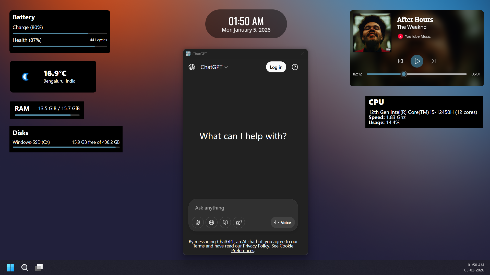
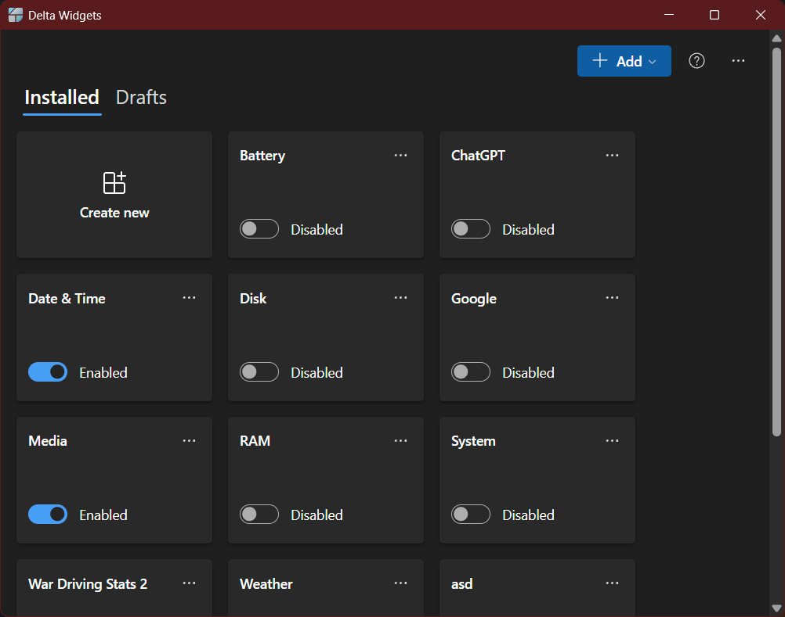
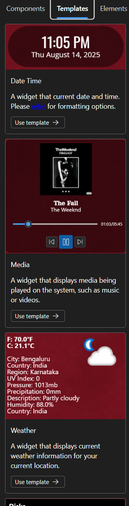

# Introduction

Welcome to the **Delta Widgets Wiki**

Delta Widgets is a **widget maker for Windows** (for now), built with [Tauri](https://tauri.app/) and Rust.
It lets you create desktop widgets with **drag & drop**, **custom HTML/CSS**, and **dynamic data** — all without needing to write code.

---

## Features

- **Drag-and-Drop Builder:** No coding needed; place components like containers, grids, text, images, progress bars, sliders, or media actions.
- **Multiple Sources:** Choose between Visual Editor, HTML, or URL for widget creation.
- **Custom Templates:** Start from pre-built widget layouts or design your own.
- **Dynamic Data:** Widgets can display system info, current time, or media playback details.
- **Expressions & Variables:** Use handlebar-like syntax to embed variables inside text or images.
- **Extensibility:** Future plan includes custom buttons and more widget actions.
- **Tauri Integration:** Access to native commands for system/media info inside HTML widgets.

---

## Screenshots

### Desktop

### Main window

### Creator window

### Templates

---

Happy widget building!
