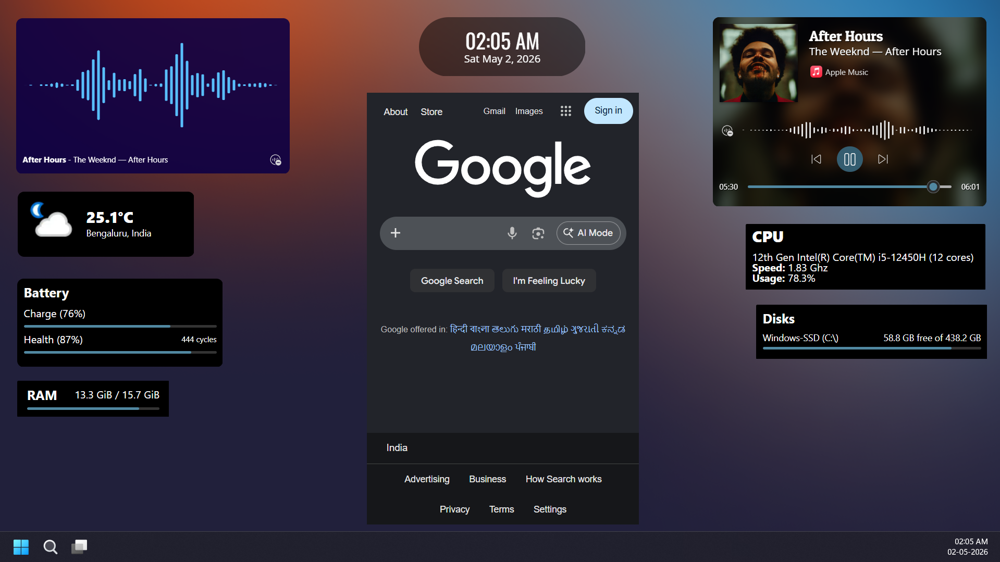
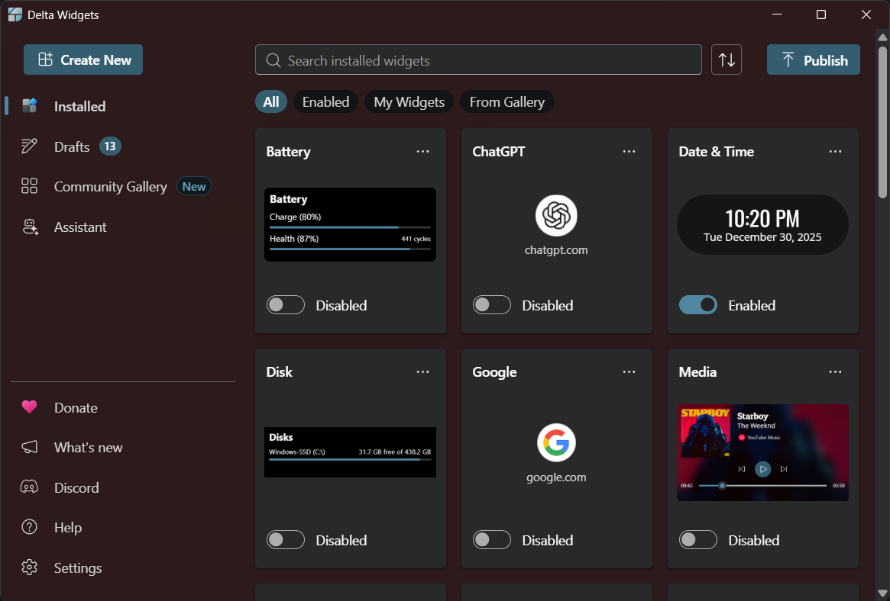
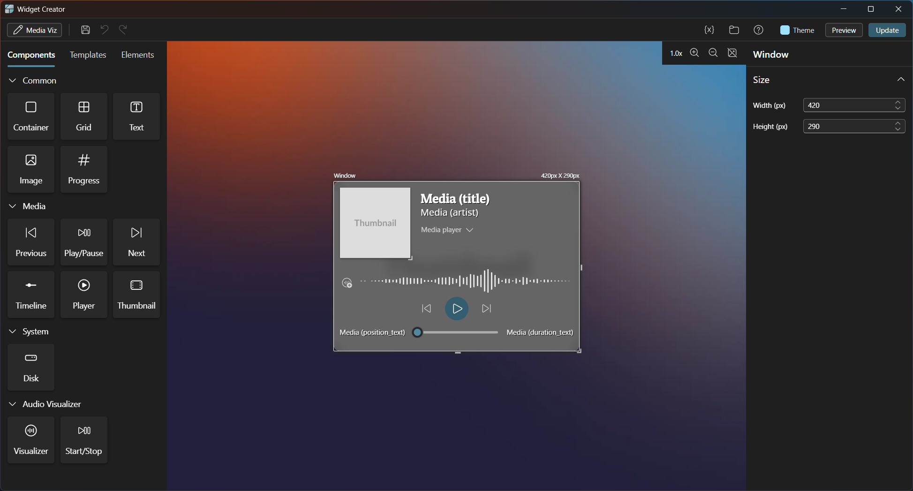
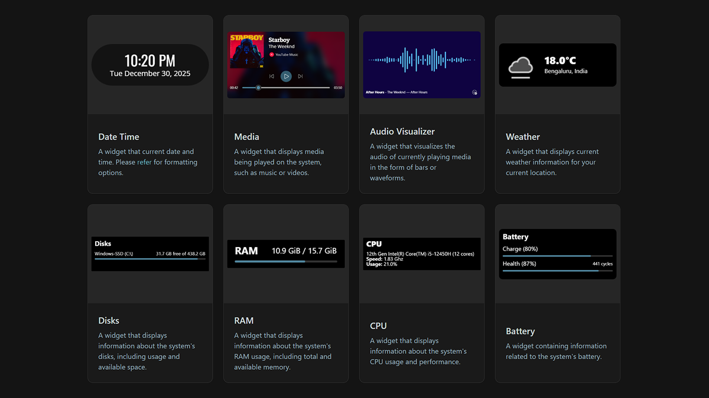

# Introduction

Welcome to the **Delta Widgets Wiki**

Delta Widgets is a **widget maker for Windows** (for now), built with [Tauri](https://tauri.app/) and Rust.
It lets you create desktop widgets with **drag & drop**, **custom HTML/CSS**, and **dynamic data** — all without needing to write code.

---

## Features

- **Drag-and-Drop Builder:** No coding needed; place components like containers, grids, text, images, progress bars, sliders, media controls, or an audio visualizer.
- **Multiple Sources:** Choose between Visual Editor, HTML, or URL for widget creation.
- **Custom Templates:** Start from pre-built widget layouts or design your own.
- **Dynamic Data:** Show live time/date, media playback, system stats (CPU, memory, battery…), and weather. See the [Variables Reference](variables.md).
- **Expressions & Variables:** Use handlebar-like syntax like `{{time:HH:mm}}` or `{{media:title}}` to embed live values in text and images.
- **AI Assistant _(optional, BYOK)_:** Generate and edit widgets from a chat prompt using your own OpenAI / Anthropic / Google / Ollama / OpenRouter key. See the [AI Assistant](ai-assistant.md).
- **Tauri Integration:** Access native commands for system/media/audio info inside HTML widgets — see [Commands](commands.md) and [Events](events.md).
- **Community Gallery _(coming soon)_:** Upload and discover Visual Editor, HTML, and URL widgets right from the app. [Join the waitlist »](https://forms.gle/Y7ni54Eknp599nG6A)

---

## Screenshots

### Desktop

### Main window

### Creator window

### Templates

---

Happy widget building!
