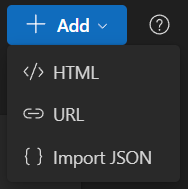

# Overview

Delta Widgets supports three different ways to create widgets. You can choose the method that best fits your use case — whether you prefer drag-and-drop building, writing your own HTML/CSS, or simply embedding an existing webpage.



---

## Visual Editor Widgets

The Visual Editor is the easiest way to build widgets without coding. It uses a drag-and-drop builder where you can place components, rearrange layouts, and apply styles.


### Available Components

- **Container / Grid** – Structure your widget with flexible layouts. Use grids for multi-column designs.
- **Text** – Add static or dynamic text (supports expressions and variables).
- **Image** – Display images from local files, URLs, or variable sources.
- **Progress Slider** – Useful for volume bars, progress indicators, or custom metrics.
- **Media Controls** – Play, pause, skip, and display media playback info.
- **Custom Button** _(planned)_ – Will allow adding custom actions.

### Templates

- Start with built-in templates for common use cases (clocks, media players, system stats).
- Clone and customize templates to speed up widget creation.

### Dynamic Variables

Visual Editor widgets support **handlebar-like** variables inside text and image components.

Example:

```
{{time}}         → Displays current system time
{{system_info}}  → Displays CPU / RAM usage
{{media_info}}   → Displays currently playing track
```

You can also format some variables:

```
{{time:HH:mm:ss}}
```

### Publishing

Unless you publish your widget, it will show up in the "Drafts" section of the main window.

Once you are done editing your widget, click on "Publish" to make it visible on the "Installed" section on the main window.

From there you can enable/disable your widget.

---

## Custom HTML Widgets

For developers and advanced users, you can create widgets using **custom HTML, CSS, and JavaScript**.

To add an HTML widget, click on `HTML` from the `Add` button, it will ask to open a folder containing an `index.html`

This gives you complete control over layout and behavior.

### Features

- Embed any HTML and style it with CSS.
- Add interactive behavior with JavaScript.
- Access Tauri commands for system or media data.

### Tauri Commands

You can call native [Tauri commands](/commands) to fetch live data:

- `get_media` → Returns currently playing media info.
- `get_system_info` → Returns system stats (CPU, memory, etc.).

!!! warning

    Unlike the Visual Editor, you are responsible for updating and maintaining widget state in HTML widgets.
    See [useVariableUpdater.ts] for reference.

[useVariableUpdater.ts]: https://github.com/amaan-mohib/delta-widgets/blob/main/src/widget/useVariableUpdater.ts#L89

### Example

```html
<div class="widget">
  <h2 id="track"></h2>
  <script>
    async function updateTrack() {
      const info = await window.__TAURI__.invoke("get_media");
      document.getElementById("track").textContent = info[0].title;
    }
    setInterval(updateTrack, 1000);
  </script>
</div>
```

### Limitations

- Dynamic variables (`{{time}}`, `{{media:title}}`, etc.) from the visual editor are not available here.
- `window.__TAURI__` exists but [**not recommended**](/commands/#best-practices) (lost on redirects, fragile)

#### Why don’t dynamic variables (`{{...}}`) work in HTML widgets?

Dynamic variables like `{{time}}`, `{{media}}`, etc. are only available inside the Visual Editor.
They're powered by the editor's own runtime, which injects and replaces variables in real-time.

When you use an HTML widget (i.e. rendering your own `index.html`), it runs in a plain WebView context.
This means:

- There's no runtime to parse/replace variables.
- Instead, you’ll need to use Tauri commands (invoke) or events (like media_updated) to fetch the data you need.

👉 If you want templating with `{{variables}}`, build your widget in the [Visual Editor](#visual-editor-widgets).

👉 If you want full control with custom HTML/JS, use [**Tauri APIs**](/commands/#recommended-approach) directly.

---

## URL Widgets

Sometimes you don't need to build from scratch — you can just load a webpage as a widget.


### How it works

- Enter a URL, and the widget displays that webpage directly.
- Useful for dashboards, web apps, or embedding online tools.

### Window Behavior

- A title bar is added to URL widgets so you can drag the widget around your desktop.
- The title bar cannot be removed (it ensures the window remains draggable).

### Limitations

- You cannot directly inject variables or Tauri commands into URL widgets.
- They are sandboxed to display external content only.
